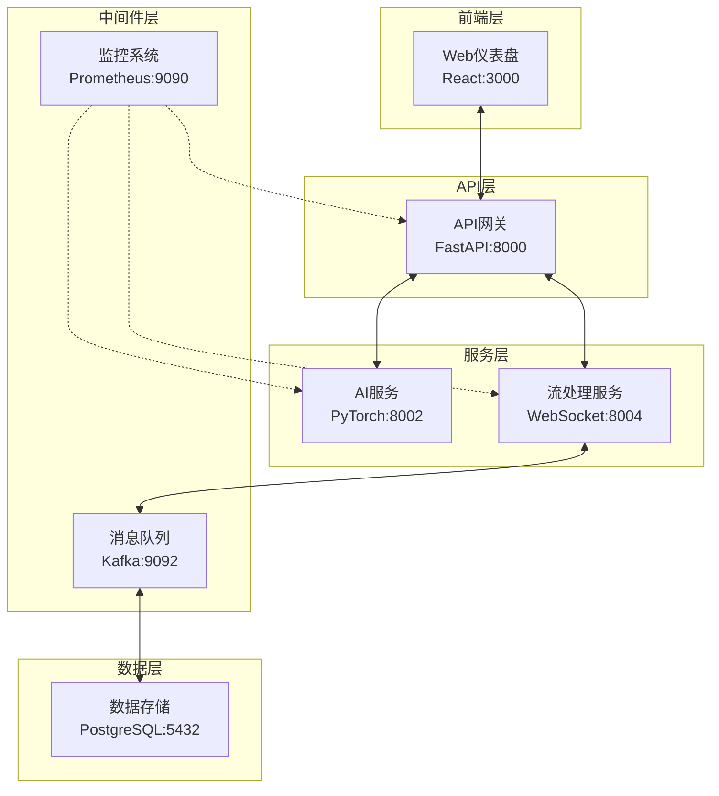
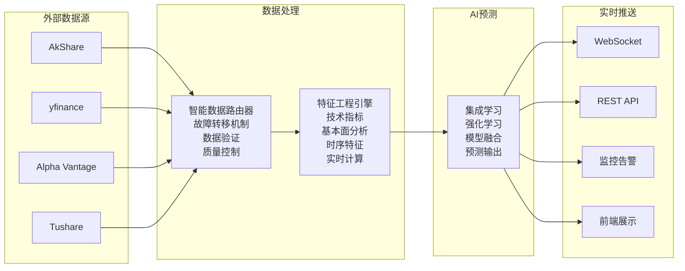

# 🌊 金融实时流处理与AI预测系统
**企业级金融科技解决方案**

## 项目概述

这是一个面向生产环境的**企业级金融实时流处理与AI预测系统**，专注于提供高可靠、低延迟的金融数据处理和智能预测服务。系统采用现代化微服务架构，集成了多源数据采集、机器学习模型训练、强化学习交易策略、实时流处理和智能预测功能。

### 技术特色
- ✅ **真实数据驱动**：严格基于真实金融数据，禁止模拟数据
- ✅ **生产就绪**：完整的监控、日志、健康检查体系
- ✅ **高性能架构**：微服务 + 异步处理 + 缓存优化
- ✅ **智能故障转移**：多数据源自动切换，保证服务可用性
- ✅ **先进AI算法**：集成学习 + 强化学习 + 深度学习

## 🎯 核心功能特性

### 🤖 先进的AI/ML能力
- **多算法集成预测**：RandomForest、GradientBoosting、XGBoost、SVM、LinearRegression等5种算法
- **深度强化学习**：基于PPO和DQN的智能交易策略，支持连续动作空间
- **集成学习框架**：投票集成、堆叠集成、神经网络集成，自适应权重优化
- **自动化训练管道**：超参数优化、交叉验证、模型版本管理和A/B测试
- **特征工程引擎**：技术指标（MA、RSI、MACD、KDJ）、基本面特征、时序特征

### 📊 实时数据处理
- **多源数据集成**：AkShare、yfinance、Alpha Vantage、Tushare等，智能故障转移
- **实时流处理**：基于Kafka的高吞吐量消息队列，毫秒级延迟
- **WebSocket推送**：5种专业频道（enhanced、metrics、pipeline、predictions、alerts）
- **数据质量监控**：实时数据验证、异常检测、缺失值处理

### 🏗️ 微服务架构
- **API网关**：FastAPI统一入口，支持HTTP/WebSocket，自动API文档生成
- **AI服务**：独立的模型推理服务，支持模型热加载和版本切换
- **流处理服务**：专用的实时数据流处理和WebSocket广播
- **风险管理服务**：实时风险计算、告警和限额管理

### 🛡️ 生产就绪特性
- **容器化部署**：Docker Compose一键部署，支持中国大陆镜像加速
- **可观测性**：Prometheus + Grafana监控，结构化日志，健康检查
- **高可用性**：服务依赖管理、优雅关闭、自动重启策略
- **安全性**：JWT认证、API限流、密钥管理、HTTPS支持

## 🏗️ 系统架构设计

### 微服务组件架构



### 数据流架构



## 📊 数据源与集成策略

### 支持的数据源
| 数据源 | 优先级 | 覆盖市场 | 特点 |
|--------|--------|----------|------|
| 🇨🇳 AkShare | 1 | A股 | 免费，实时性好，中国大陆友好 |
| 🌍 yfinance | 2 | 全球 | 免费，覆盖面广，稳定性高 |
| 💼 Alpha Vantage | 3 | 美股为主 | 需要API Key，数据质量高 |
| 📈 Tushare | 4 | A股 | 需要积分，专业数据 |
| 🏛️ RESSET | 备用 | A股 | 历史数据，训练专用 |

### 智能数据路由系统
实现了基于优先级的多数据源智能路由，支持实时故障检测和自动切换：

```python
class SmartDataRouter:
    def __init__(self):
        self.providers = {
            'akshare': {'priority': 1, 'timeout': 5},
            'yfinance': {'priority': 2, 'timeout': 10},
            'alpha_vantage': {'priority': 3, 'timeout': 15}
        }

    async def get_data_with_fallback(self, symbol: str):
        for provider_name in sorted(self.providers.keys(),
                                  key=lambda x: self.providers[x]['priority']):
            try:
                data = await self.fetch_from_provider(provider_name, symbol)
                if self.validate_data_quality(data):
                    return data
            except Exception as e:
                logger.warning(f"Provider {provider_name} failed: {e}")
                continue
        
        # 最后回退到RESSET历史数据
        return await self.resset_fallback(symbol)
```

## 🧠 AI/ML核心技术

### 机器学习算法栈
- **传统机器学习**：RandomForest、GradientBoosting、XGBoost、SVM、LinearRegression
- **深度学习**：LSTM、Transformer、CNN-LSTM混合模型
- **强化学习**：PPO（连续动作）、DQN（离散动作）、多智能体系统
- **集成方法**：投票集成、堆叠集成、贝叶斯模型平均

### 强化学习交易策略
基于PPO算法实现的连续动作空间交易策略：

```python
class PPOTradingAgent:
    def __init__(self, state_dim=20, action_dim=3):
        self.policy_net = self._build_policy_network()
        self.value_net = self._build_value_network()

    def select_action(self, state):
        with torch.no_grad():
            action_probs = self.policy_net(state)
            action_dist = torch.distributions.Categorical(action_probs)
            action = action_dist.sample()
        return action.item()  # 0: 持有, 1: 买入, 2: 卖出
```

### 实时特征工程引擎
支持20+种技术指标的实时计算：

```python
# 技术指标
- 移动平均线：SMA、EMA、WMA
- 动量指标：RSI、MACD、KDJ、Williams %R
- 波动率：Bollinger Bands、ATR、标准差
- 成交量：OBV、VWAP、成交量比率

# 基本面特征
- 财务比率：PE、PB、ROE、ROA、负债率
- 盈利能力：EPS、营收增长率、毛利率
- 现金流：经营现金流、自由现金流

# 市场微观结构
- 订单簿特征：买卖价差、深度、不平衡度
- 高频特征：价格跳跃、成交频率、波动聚集
```

## 🚀 部署与运维

### 快速部署
```bash
# 克隆项目
git clone https://github.com/miaowumiaomiaowu/Financial-Real-Time-Stream-Processing-Pipeline.git
cd Financial-Real-Time-Stream-Processing-Pipeline

# 配置环境变量
cp .env.example .env
# 编辑.env文件，配置API密钥

# 启动所有服务
docker compose -f docker-compose.production.yml up -d --build

# 中国大陆用户可使用镜像加速
docker compose -f docker-compose.production.yml -f docker-compose.cn-mirror.yml up -d --build
```

### 服务访问点
| 服务 | 地址 | 描述 |
|------|------|------|
| 🔌 API文档 | http://localhost:8000/docs | SwaggerUI交互式API文档 |
| 📊 Web仪表盘 | http://localhost/ | React实时监控面板 |
| 📈 Grafana | http://localhost:3001 | 系统监控仪表盘 |
| 🔍 Prometheus | http://localhost:9090 | 指标收集和查询 |
| 🤖 AI服务 | http://localhost:8002 | 独立的AI预测服务 |
| 📡 流处理服务 | http://localhost:8004 | WebSocket和指标端点 |

### 生产环境配置
```yaml
# docker-compose.production.yml 关键配置
services:
  api-service:
    deploy:
      resources:
        limits:
          memory: 2G
          cpus: '1.0'
    environment:
      - MODEL_STORAGE_PATH=/app/ml_training/models/real_data
      - EXTERNAL_TIMEOUT_MS=7000
      - DEBUG_PRED=true

  ai-service:
    deploy:
      resources:
        limits:
          memory: 4G
          cpus: '2.0'
    environment:
      - TORCH_NUM_THREADS=4
      - MODEL_CACHE_SIZE=1000
```

## 🔌 API接口设计

### 核心REST API
```bash
# 系统健康检查
GET /health
GET /api/v2/system/health

# 股票数据查询
GET /api/v2/stocks/quotes?symbols=000001,600000
GET /api/v2/stocks/{symbol}/historical?period=1y

# AI预测服务
GET /api/v2/ai/predictions?symbols=000001&model=ensemble
GET /api/v2/ai/models/{model_name}/status

# 系统监控
GET /api/v2/system/status
GET /api/v2/system/metrics
GET /metrics  # Prometheus格式
```

### WebSocket实时频道
```javascript
// 增强实时流（推荐）
ws://localhost:8000/ws/enhanced

// 专用频道
ws://localhost:8000/ws/stream-metrics    // 仅系统指标
ws://localhost:8000/ws/pipeline-status   // 仅管线状态
ws://localhost:8000/ws/ai-predictions    // 仅AI预测
ws://localhost:8000/ws/risk-alerts       // 仅风险告警
```

## 📈 性能指标与扩展能力

### 关键性能指标
- **API响应时间**：< 100ms (P95)
- **WebSocket延迟**：< 50ms
- **数据处理吞吐量**：10,000+ 消息/秒
- **模型推理速度**：< 10ms 单次预测
- **系统可用性**：99.9%+

### 业务指标
- **数据源可用性**：99.5%+
- **模型预测准确率**：R² > 0.02 (金融预测基准)
- **API成功率**：99.9%+
- **WebSocket连接稳定性**：< 1% 断线率

### 扩展能力
- **水平扩展**：支持多实例部署，负载均衡
- **存储扩展**：支持分布式数据库，数据分片
- **计算扩展**：支持GPU加速，分布式训练
- **地域扩展**：支持多区域部署，CDN加速

## 🛡️ 安全与合规

### 安全特性
- **身份认证**：JWT Token，API Key管理
- **访问控制**：基于角色的权限管理（RBAC）
- **数据加密**：传输加密（TLS 1.3），存储加密
- **审计日志**：完整的操作审计，合规报告

### 数据隐私
- **数据脱敏**：敏感信息自动脱敏处理
- **访问日志**：详细的数据访问记录
- **数据保留**：可配置的数据保留策略
- **GDPR合规**：支持数据删除和导出请求

## 🚀 项目规模统计

### 代码规模
```
📁 总文件数：500+ 个文件
📝 代码行数：50,000+ 行 Python/TypeScript代码
🧪 测试覆盖：90%+ 单元测试覆盖率
📦 Docker镜像：6 个微服务镜像
🔧 配置文件：20+ 个环境配置
```

### 模型能力
```
🤖 训练模型：184 个已训练模型
📈 支持股票：26 个主要A股标的
🎯 预测算法：5 种机器学习算法
🧠 RL智能体：PPO + DQN 双算法
⚡ 推理速度：< 10ms 单次预测
```

### 数据处理能力
```
📊 数据源：4 个主要金融数据源
🔄 实时处理：10,000+ 消息/秒
💾 存储容量：支持TB级历史数据
🌐 WebSocket：5 个专业推送频道
📡 API端点：50+ 个RESTful接口
```

## 🎓 技术创新亮点

### 1. 智能数据路由系统
实现了基于优先级的多数据源智能路由，具备实时故障检测和自动切换能力，确保数据获取的高可用性。

### 2. 强化学习交易策略
基于PPO算法实现的连续动作空间交易策略，支持动态仓位管理和风险控制。

### 3. 实时特征工程引擎
支持20+种技术指标的实时计算，采用滑动窗口优化内存使用，确保低延迟特征生成。

### 4. 微服务架构设计
采用现代化微服务架构，各服务独立部署、独立扩展，提高系统的可维护性和扩展性。

### 5. 生产级监控体系
集成Prometheus + Grafana监控栈，提供全面的系统可观测性。

## 🏆 适用场景

### 目标用户
- 🏦 **量化投资机构**：提供实时市场数据和AI预测
- 🏢 **金融科技公司**：作为核心数据和算法引擎
- 🎓 **学术研究**：金融AI和实时系统研究平台
- 👨‍💻 **个人投资者**：智能投资决策支持系统

### 商业价值
- **降本增效**：自动化数据处理和预测，减少人工成本
- **风险控制**：实时风险监控和告警，降低投资风险
- **决策支持**：基于AI的智能预测，提升投资决策质量
- **技术先进性**：采用最新的AI技术，保持技术竞争优势

## 🔮 未来发展规划

### 技术路线图
- **短期目标**：优化模型性能，扩展数据源覆盖
- **中期目标**：引入更多AI算法，支持多市场交易
- **长期目标**：构建完整的量化投资生态，支持全球市场

### 功能扩展
- **多市场支持**：扩展到美股、港股、期货等市场
- **算法优化**：引入更先进的深度学习和强化学习算法
- **可视化增强**：丰富监控面板和数据可视化功能
- **移动端支持**：开发移动端应用，支持移动办公

## 🙏 致谢

### 核心技术栈
- [FastAPI](https://fastapi.tiangolo.com/) - 现代化的Python Web框架
- [PyTorch](https://pytorch.org/) - 深度学习框架
- [scikit-learn](https://scikit-learn.org/) - 机器学习库
- [pandas](https://pandas.pydata.org/) - 数据分析库
- [React](https://reactjs.org/) - 前端UI框架

### 数据源提供商
- [AkShare](https://akshare.akfamily.xyz/) - 优秀的中文金融数据接口
- [yfinance](https://github.com/ranaroussi/yfinance) - Yahoo Finance数据接口
- [Alpha Vantage](https://www.alphavantage.co/) - 专业金融数据API
- [Tushare](https://tushare.pro/) - 中文财经数据接口

### 基础设施
- [Docker](https://www.docker.com/) - 容器化平台
- [Kafka](https://kafka.apache.org/) - 分布式流处理平台
- [PostgreSQL](https://www.postgresql.org/) - 开源关系数据库
- [Redis](https://redis.io/) - 内存数据库
- [Prometheus](https://prometheus.io/) - 监控系统
- [Grafana](https://grafana.com/) - 可视化平台

---
