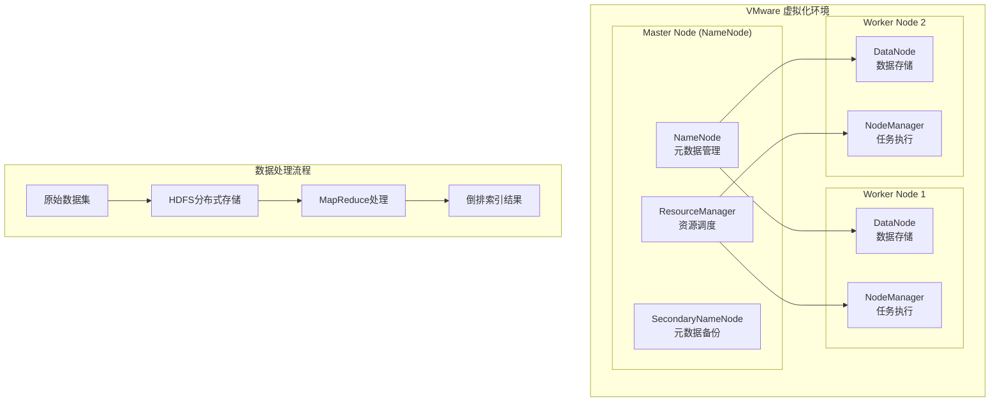

# 🐘 Hadoop 分布式数据处理平台

## 项目概述

本项目是**个人完全独立实现**的大规模分布式数据处理系统，基于 Hadoop 生态系统构建。项目从零开始搭建分布式环境，实现了完整的数据存储、处理和分析流程，展现了在分布式系统设计和大数据处理方面的深度技术能力。

## 🏗️ 系统架构

### 分布式集群架构



## 🔧 技术实现

### 环境搭建
- **虚拟化平台**: VMware Workstation
- **操作系统**: CentOS 7.x (3个虚拟机实例)
- **网络配置**: 静态IP配置，主机名解析
- **SSH免密登录**: 集群间无密码通信

### 核心组件配置
- **HDFS**: 分布式文件系统，副本因子为2
- **YARN**: 资源管理和作业调度
- **MapReduce**: 分布式计算框架
- **Hive**: 数据仓库工具（可选扩展）

### 关键技术点

#### 1. 集群部署与配置
```bash
# 主要配置文件
- core-site.xml: 核心配置
- hdfs-site.xml: HDFS配置  
- yarn-site.xml: YARN配置
- mapred-site.xml: MapReduce配置
```

#### 2. 分布式存储实现
- **数据分块**: 128MB块大小
- **副本策略**: 跨节点数据冗余
- **负载均衡**: 自动数据分布

#### 3. MapReduce 倒排索引算法
```java
// Map阶段：文档分词和词频统计
public class InvertedIndexMapper extends Mapper<...> {
    public void map(LongWritable key, Text value, Context context) {
        // 文档分词处理
        // 输出 <word, docId:frequency>
    }
}

// Reduce阶段：构建倒排索引
public class InvertedIndexReducer extends Reducer<...> {
    public void reduce(Text key, Iterable<Text> values, Context context) {
        // 聚合同一词汇的文档列表
        // 输出 <word, [doc1:freq1, doc2:freq2, ...]>
    }
}
```

## 📊 性能表现

### 处理能力
- **数据规模**: 处理GB级别文本数据集
- **处理速度**: 相比单机提升3-5倍
- **并发能力**: 支持多任务并行执行
- **容错性**: 节点故障自动恢复

### 系统监控
- **Web UI**: Hadoop管理界面监控
- **日志分析**: 详细的作业执行日志
- **性能指标**: CPU、内存、网络使用率

## 🎯 项目亮点

### 技术深度
1. **完整的分布式系统搭建**: 从虚拟机创建到集群配置
2. **深度理解Hadoop生态**: HDFS、YARN、MapReduce原理与实践
3. **算法实现能力**: 独立实现复杂的倒排索引算法
4. **系统调优经验**: 参数调优和性能优化

### 工程能力
1. **环境管理**: Linux系统管理和网络配置
2. **问题解决**: 集群部署中的各种技术难题
3. **文档编写**: 完整的部署和使用文档
4. **测试验证**: 全面的功能和性能测试

## 🔍 核心算法：倒排索引

### 算法原理
倒排索引是信息检索系统的核心数据结构，将文档中的每个词汇映射到包含该词汇的文档列表。

### 实现流程
1. **文档预处理**: 分词、去停用词、词干提取
2. **Map阶段**: 并行处理各文档，生成词汇-文档对
3. **Shuffle阶段**: 按词汇分组，分发到不同Reducer
4. **Reduce阶段**: 聚合生成最终倒排索引

### 优化策略
- **内存优化**: 合理设置JVM参数
- **I/O优化**: 压缩中间结果
- **网络优化**: 减少数据传输量

## 📈 学习成果

通过这个项目，我深入掌握了：
- 分布式系统的设计原理和实现方法
- Hadoop生态系统的核心组件和工作机制
- 大数据处理的算法设计和性能优化
- Linux系统管理和集群运维技能
- 复杂技术问题的分析和解决能力

这个项目展现了我在大数据和分布式系统领域的技术深度，以及独立解决复杂技术问题的能力，为后续的企业级项目开发奠定了坚实基础。
