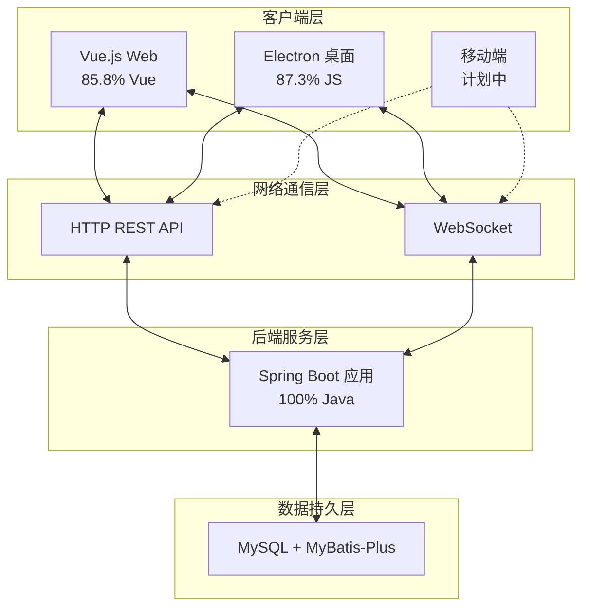
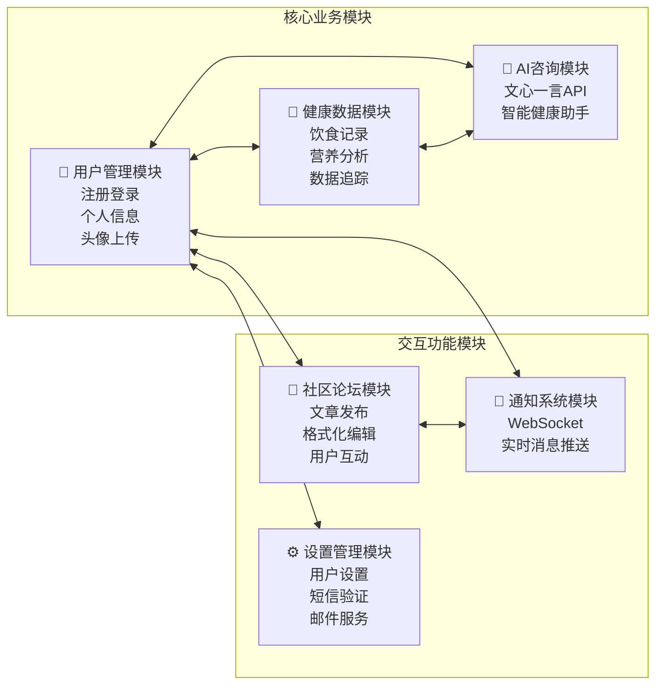
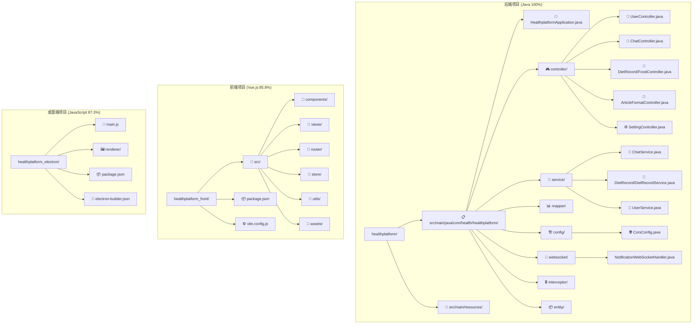

# 🏥 健康管理平台
**基于Spring Boot + Vue.js + Electron的全栈智能健康管理解决方案**

## 项目概述

健康管理平台是一个现代化的全栈健康管理解决方案，采用前后端分离架构，提供Web端和桌面端双重体验。该平台集成了用户管理、饮食记录、AI健康咨询、论坛社区、实时通知等核心功能，旨在为用户提供全方位的健康管理服务。

### 技术架构特色
- ✅ **前后端分离**：Spring Boot REST API + Vue.js SPA + Electron 桌面应用
- ✅ **AI 智能集成**：接入百度文心一言API，提供智能健康咨询服务
- ✅ **实时通信**：WebSocket实现消息推送和实时通知
- ✅ **营养管理**：完整的饮食记录和营养分析系统
- ✅ **跨平台支持**：Web端 + Electron桌面端，覆盖多终端使用场景

## 🏗️ 系统架构设计

### 整体架构图



### 微服务模块划分



## 📊 技术栈详解

### 后端技术栈 (nova728/healthplatform)
| 技术 | 占比 | 特点与应用 |
|------|------|------------|
| ☕ **Java** | 100% | Spring Boot 3.x，RESTful API设计 |
| 🚀 **Spring Boot** | - | 微服务架构，自动配置，快速开发 |
| 💾 **MyBatis-Plus** | - | 数据持久层，SQL映射，CRUD操作 |
| 🌐 **WebSocket** | - | 实时通信，消息推送系统 |
| 🤖 **AI集成** | - | 百度文心一言API，智能对话 |
| 📧 **通信服务** | - | 阿里云短信、JavaMail邮件服务 |

### 前端技术栈 (nova728/healthplatform_front)
| 技术 | 占比 | 特点与应用 |
|------|------|------------|
| 💚 **Vue.js** | 85.8% | Vue 3 + Composition API，响应式UI |
| 🎨 **CSS** | 6.5% | 现代化样式设计，响应式布局 |
| ⚡ **JavaScript** | 5.8% | ES6+语法，模块化开发 |
| 📄 **HTML** | 1.9% | 语义化标签，良好的可访问性 |

### 桌面端技术栈 (miaowumiaomiaowu/healthplatform_electron)
| 技术 | 占比 | 特点与应用 |
|------|------|------------|
| 🟨 **JavaScript** | 87.3% | Electron主进程和渲染进程 |
| 📄 **HTML** | 12.7% | 桌面应用界面结构 |
| ⚡ **Electron** | - | 跨平台桌面应用开发框架 |

## 🌟 核心功能模块

### 🔐 用户管理系统
```java
@RestController
@RequestMapping("/api/user")
public class UserController {
    // 用户注册登录
    @PostMapping("/login")
    public Result login(@ModelAttribute("user") User user)
    
    @PostMapping("/register") 
    public Result register(@ModelAttribute("user") User user)
    
    // 头像上传
    @PostMapping("/{id}/uploadAvatar")
    public Result uploadAvatar(@PathVariable Integer id, @RequestParam("file") MultipartFile file)
    
    // 个人信息更新
    @PutMapping("/{id}/update")
    public Result updateUserInfo(@PathVariable Integer id, @RequestBody User user)
}
```

**核心特性：**
- JWT令牌身份认证
- 头像上传和存储
- 个人信息管理
- 密码找回功能
- 用户统计分析

### 🍎 饮食营养管理
```java
@Service
public class DietRecordService {
    @Transactional
    public NutritionSummaryDTO addMealRecord(Integer userId, LocalDate date, MealRecordDTO mealDTO)
    
    @Transactional
    public NutritionSummaryDTO deleteMealRecord(Integer userId, Long mealId)
    
    public NutritionSummaryDTO getDailyNutritionSummary(Integer userId, LocalDate date)
}
```

**功能亮点：**
- 详细的饮食记录管理
- 营养成分自动计算
- 每日营养摄入统计
- 食物数据库查询
- 营养目标跟踪

### 🤖 AI健康咨询助手
```java
@Service
public class ChatService {
    // 文心一言API集成
    public ChatResponse processMessage(ChatRequest request) {
        String accessToken = getOrRefreshAccessToken();
        String response = callErnieBot(request.getMessage(), accessToken);
        return new ChatResponse(response);
    }
    
    // Token管理和API调用
    private String callErnieBot(String message, String accessToken) throws IOException {
        // 百度文心一言API调用逻辑
    }
}
```

**智能特性：**
- 集成百度文心一言大语言模型
- 智能健康问答和建议
- 个性化营养指导
- 运动健身建议
- API限流和错误处理

### 📡 实时通知系统
```java
@Component("notificationWebSocketHandler")
public class NotificationWebSocketHandler extends TextWebSocketHandler {
    // WebSocket会话管理
    private static final ConcurrentHashMap<Integer, WebSocketSession> SESSIONS = new ConcurrentHashMap<>();
    
    // 实时消息推送
    public void sendNotificationToUser(Integer userId, Object notification) {
        WebSocketSession session = SESSIONS.get(userId);
        // 发送消息逻辑
    }
}
```

**通信特性：**
- WebSocket长连接
- 用户会话管理
- 实时消息推送
- 连接状态监控
- 多终端同步

### 📝 内容管理系统
```java
@RestController
@RequestMapping("/api/articles/format")
public class ArticleFormatController {
    // Markdown格式化
    private String formatHeading(String content, String level, int startPos, int endPos)
    
    // HTML内容处理
    private String formatHtmlContent(String htmlContent, String type, int startPos, int endPos)
}
```

**编辑特性：**
- 富文本编辑器
- Markdown格式支持
- 实时预览功能
- 文章格式化工具
- 内容版本管理

## 🛠️ 项目结构

### 项目结构总览



## ⚙️ 核心技术实现

### CORS跨域配置
```java
@Configuration
public class CorsConfig {
    @Bean
    public CorsFilter corsFilter() {
        UrlBasedCorsConfigurationSource source = new UrlBasedCorsConfigurationSource();
        CorsConfiguration config = new CorsConfiguration();
        config.addAllowedOrigin("http://localhost:5173"); // Vue开发服务器
        config.setAllowCredentials(true);
        config.addAllowedHeader("*");
        config.addAllowedMethod("*");
        return new CorsFilter(source);
    }
}
```

### JWT认证机制
```java
public class MyHandler implements HandlerInterceptor {
    // JWT Token验证
    // 用户信息提取
    // ThreadLocal存储
}
```

### 日期时间处理
```java
@Bean
public Jackson2ObjectMapperBuilderCustomizer jacksonObjectMapperCustomization() {
    return jacksonObjectMapperBuilder ->
            jacksonObjectMapperBuilder.timeZone(TimeZone.getTimeZone("GMT+8"))
                    .dateFormat(new SimpleDateFormat("yyyy-MM-dd'T'HH:mm:ss.SSS'Z'"));
}
```

## 🚀 部署与运维

### 开发环境要求
```bash
# 后端环境
Java 17+
Spring Boot 3.x
MySQL 8.0+
Maven 3.8+

# 前端环境  
Node.js 16+
Vue.js 3.x
Vite 4.x

# 桌面端环境
Electron 20+
Node.js 16+
```

### 快速启动指南
```bash
# 1. 启动后端服务
cd healthplatform
mvn spring-boot:run

# 2. 启动前端开发服务器
cd healthplatform_front  
npm install
npm run dev

# 3. 启动桌面应用
cd healthplatform_electron
npm install
npm run electron:dev
```

### 服务端口配置
| 服务 | 端口 | 描述 |
|------|------|------|
| 🔌 后端API | 8080 | Spring Boot主服务 |
| 🌐 前端Web | 5173 | Vite开发服务器 |
| 💻 桌面应用 | - | Electron本地应用 |
| 📡 WebSocket | 8080 | 实时通信服务 |

## 📊 项目统计

### 代码规模
```
📁 后端项目：2,000+ 行Java代码
📁 前端项目：5,000+ 行Vue.js代码  
📁 桌面端：1,000+ 行JavaScript代码
📦 总计：8,000+ 行高质量代码
🧪 测试覆盖：规划中
🔧 配置文件：30+ 个配置文件
```

### 功能模块统计
```
👤 用户管理：注册登录、信息管理、头像上传
🍎 饮食管理：营养记录、数据分析、目标跟踪
🤖 AI助手：智能问答、健康建议、个性化指导
📝 内容管理：文章编辑、格式化、发布系统
📡 实时通知：WebSocket推送、多终端同步
⚙️ 系统设置：用户配置、消息服务、权限管理
```

### 技术特色统计
```
🏗️ 架构设计：前后端分离、微服务架构
🔄 实时通信：WebSocket长连接、消息推送
🤖 AI集成：百度文心一言API、智能对话
📱 跨平台：Web端 + 桌面端双重体验
🛡️ 安全特性：JWT认证、CORS配置、数据验证
```

## 🎯 核心价值与特色

### 技术创新
- **前后端分离架构**：Spring Boot + Vue.js现代化技术栈
- **AI智能集成**：接入百度文心一言，提供智能健康咨询
- **跨平台体验**：Web端和Electron桌面端双重覆盖
- **实时通信系统**：WebSocket实现消息推送和实时交互

### 业务价值
- **健康数据管理**：完整的饮食记录和营养分析系统
- **智能健康助手**：AI驱动的个性化健康建议和指导
- **社区互动平台**：用户交流分享的健康社区环境
- **多终端同步**：数据在多个终端间实时同步

### 用户体验
- **直观界面设计**：现代化UI设计，用户操作简单直观
- **响应式布局**：适配不同设备屏幕，良好的移动端体验  
- **实时数据更新**：WebSocket确保数据实时性
- **离线桌面应用**：Electron提供原生桌面应用体验

## 🏆 项目亮点总结

### 技术架构亮点
- **现代化技术栈**：Spring Boot 3 + Vue.js 3 + Electron最新技术
- **微服务设计**：模块化架构，高内聚低耦合
- **AI技术集成**：百度文心一言API，智能对话体验
- **实时通信**：WebSocket长连接，消息推送系统

### 功能特色亮点
- **全栈解决方案**：后端API + 前端Web + 桌面应用完整生态
- **智能健康管理**：AI驱动的个性化健康建议和营养指导
- **跨平台体验**：Web浏览器 + 桌面应用双重访问方式
- **实时数据同步**：多终端数据实时同步，无缝体验

### 开发实践亮点
- **规范代码结构**：清晰的分层架构和模块划分
- **完善错误处理**：全局异常处理和友好错误提示
- **性能优化**：API限流、缓存机制、连接池管理
- **安全防护**：JWT认证、CORS配置、SQL注入防护

## 🙏 致谢

### 核心技术栈
- [Spring Boot](https://spring.io/projects/spring-boot) - 强大的Java微服务框架
- [Vue.js](https://vuejs.org/) - 渐进式JavaScript框架
- [Electron](https://www.electronjs.org/) - 跨平台桌面应用开发
- [MyBatis-Plus](https://baomidou.com/) - 优秀的持久层框架

### AI服务提供商
- [百度文心一言](https://yiyan.baidu.com/) - 专业的大语言模型服务
- [阿里云](https://www.aliyun.com/) - 短信和云服务支持

### 开发工具
- [IntelliJ IDEA](https://www.jetbrains.com/idea/) - Java开发IDE
- [VS Code](https://code.visualstudio.com/) - 前端开发编辑器
- [Maven](https://maven.apache.org/) - Java项目管理工具
- [Vite](https://vitejs.dev/) - 前端构建工具

---


📧 **项目地址**：
- 🔗 [后端服务](https://github.com/nova728/healthplatform)
- 🔗 [前端应用](https://github.com/nova728/healthplatform_front)  
- 🔗 [桌面端](https://github.com/miaowumiaomiaowu/healthplatform_electron)

