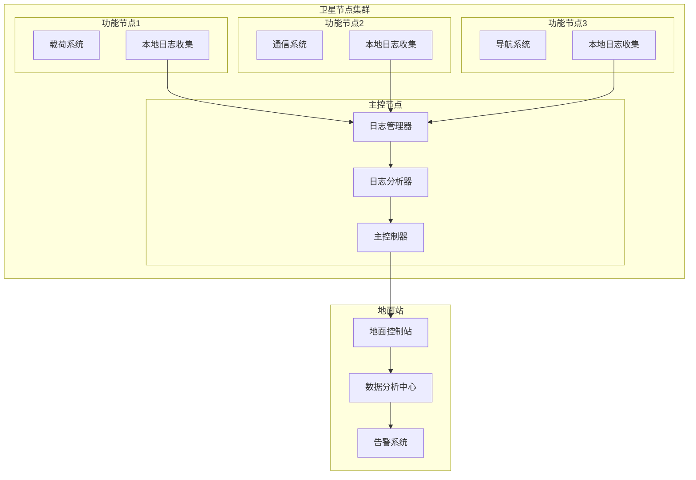

# 🛰️ 卫星分布式系统日志管理研究

## 项目概述

这是一个**导师指导的组会研究项目**，我主要参与其中的日志管理模块相关工作。项目聚焦于卫星分布式系统的技术研究，我负责日志管理相关的资料调研、文献阅读和理论分析，深入学习了在极端环境和资源受限条件下的系统设计挑战和解决思路。

## 🎯 研究背景

### 项目参与背景
在导师的指导下，我参与了卫星分布式系统相关的研究工作，主要负责日志管理模块的调研。卫星系统作为分布式系统在极端环境下的典型应用，具有独特的技术挑战：

- **资源约束**: 计算、存储、通信资源极其有限
- **环境恶劣**: 辐射、温度变化等极端条件
- **可靠性要求**: 任务关键，容错能力要求极高
- **远程运维**: 无法物理维护，依赖智能诊断

### 研究价值
通过参与卫星分布式系统的研究，可以深入学习以下关键技术：
- 资源受限环境下的系统设计原理
- 分布式系统的容错机制和可靠性保障
- 实时监控与故障诊断方法
- 极端条件下的数据管理策略

## 🏗️ 研究架构

### 分布式日志系统架构



## 🔬 主要研究内容

### 1. 分布式日志管理调研

#### 调研重点
- **轻量级设计**: 资源受限环境下的系统架构原则
- **智能过滤**: 基于优先级的数据筛选策略
- **高效压缩**: 带宽受限下的数据传输优化
- **容错设计**: 分布式环境下的可靠性保障

#### 理论分析
```python
class SatelliteLogCollector:
    def __init__(self, node_id, resource_limit):
        self.node_id = node_id
        self.resource_limit = resource_limit
        self.log_buffer = CircularBuffer(size=resource_limit.memory)
        self.compression_engine = LZ4Compressor()
        
    def collect_log(self, log_entry):
        # 智能过滤
        if self.should_collect(log_entry):
            # 压缩存储
            compressed_entry = self.compression_engine.compress(log_entry)
            self.log_buffer.add(compressed_entry)
            
    def should_collect(self, log_entry):
        # 基于优先级和资源状况的智能决策
        priority_score = self.calculate_priority(log_entry)
        resource_usage = self.get_resource_usage()
        return priority_score > self.get_threshold(resource_usage)
```

### 2. 分布式存储机制研究

#### 技术挑战
- **存储空间限制**: 卫星存储资源极其有限
- **数据一致性**: 分布式环境下的数据同步
- **故障恢复**: 节点故障时的数据保护
- **历史数据管理**: 长期任务的日志轮转策略

#### 学习要点
```python
class DistributedLogStorage:
    def __init__(self, nodes, replication_factor=2):
        self.nodes = nodes
        self.replication_factor = replication_factor
        self.consistent_hash = ConsistentHashRing(nodes)
        
    def store_log(self, log_entry):
        # 一致性哈希分布
        primary_node = self.consistent_hash.get_node(log_entry.hash)
        replica_nodes = self.consistent_hash.get_replicas(
            log_entry.hash, self.replication_factor
        )
        
        # 异步复制存储
        futures = []
        for node in [primary_node] + replica_nodes:
            future = self.async_store(node, log_entry)
            futures.append(future)
            
        return self.wait_for_quorum(futures)
```

### 3. 故障诊断机制学习

#### 学习目标
- **异常检测**: 基于机器学习的异常模式识别
- **故障预测**: 通过日志趋势预测潜在故障
- **根因分析**: 快速定位故障根本原因
- **自动恢复**: 基于日志分析的自动故障恢复

#### 理论探索
```python
class LogAnalysisEngine:
    def __init__(self):
        self.anomaly_detector = IsolationForest()
        self.pattern_matcher = RegexPatternMatcher()
        self.trend_analyzer = TimeSeriesAnalyzer()
        
    def analyze_logs(self, log_stream):
        results = []
        for log_batch in log_stream:
            # 异常检测
            anomalies = self.detect_anomalies(log_batch)
            
            # 模式匹配
            known_issues = self.match_patterns(log_batch)
            
            # 趋势分析
            trends = self.analyze_trends(log_batch)
            
            results.append({
                'anomalies': anomalies,
                'known_issues': known_issues,
                'trends': trends,
                'timestamp': log_batch.timestamp
            })
            
        return results
```

## 📊 学习收获

### 1. 理论理解
- **资源受限系统设计**: 深入理解了在极限资源约束下的系统架构原则
- **分布式一致性理论**: 学习了分布式环境下的数据一致性保障机制
- **容错系统设计**: 掌握了高可靠性系统的设计思路和方法

### 2. 技术认知
- **系统优化思路**: 了解了在资源受限环境下的性能优化策略
- **故障诊断方法**: 学习了分布式系统的监控和诊断技术
- **数据传输优化**: 掌握了带宽受限下的数据处理方法

### 3. 知识拓展
- **文献调研**: 阅读了大量相关的学术论文和技术资料
- **理论分析**: 深入分析了各种技术方案的优缺点
- **知识整理**: 系统梳理了分布式系统在特殊环境下的应用


## 🔍 关键技术挑战

### 挑战1: 极限资源约束
**解决方案**:
- 设计超轻量级的日志代理
- 实现智能的日志采样和过滤
- 优化数据结构和算法效率

### 挑战2: 通信延迟和不稳定
**解决方案**:
- 实现本地缓存和批量传输
- 设计容错的通信协议
- 优化数据传输优先级

### 挑战3: 故障诊断的实时性
**解决方案**:
- 开发边缘计算的分析算法
- 实现分层的故障检测机制
- 优化机器学习模型的推理速度


## 🎓 个人收获

### 技术视野拓展
- **分布式系统理论**: 加深了对分布式系统设计原理的理解
- **极端环境适应**: 学习了系统在特殊约束下的设计思路
- **可靠性工程**: 了解了高可靠性系统的设计方法
- **前沿技术**: 接触了航天领域的先进技术理念

### 学习能力提升
- **文献调研**: 提高了技术文献的阅读和分析能力
- **理论思考**: 培养了从理论角度分析技术问题的思维
- **知识整合**: 学会了将不同领域的知识进行融合
- **技术敏感度**: 增强了对前沿技术发展的敏感性

### 未来发展方向
- **深入学习**: 为后续深入学习分布式系统奠定了基础
- **技术兴趣**: 激发了对系统可靠性和容错设计的兴趣
- **研究思维**: 培养了从学术角度思考技术问题的能力

这次技术调研让我对分布式系统在特殊环境下的应用有了更深的认识，也为我未来在相关技术领域的学习和实践指明了方向。
