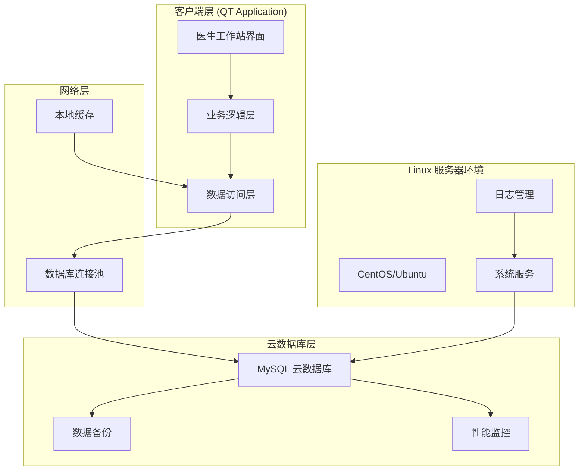

# 🏥 智慧医疗管理系统（医生端）

## 项目概述

本项目是**个人负责医生端全部功能开发**的智慧医疗管理系统，专注于为医疗机构提供高效、安全的医生工作站解决方案。项目基于Linux环境，使用QT框架开发，实现了完整的医疗业务流程管理，并部署了高可用的MySQL云数据库系统。

## 🏗️ 系统架构

### 整体架构设计



## 🔧 技术实现

### 开发环境
- **操作系统**: Linux (CentOS 7/Ubuntu 18.04)
- **开发框架**: QT 5.12+ (C++)
- **数据库**: MySQL 8.0 (云部署)
- **开发工具**: Qt Creator, GDB调试器
- **版本控制**: Git

### 核心技术栈
- **GUI框架**: QT Widgets, QML
- **数据库连接**: Qt SQL模块, 连接池管理
- **网络通信**: QNetworkAccessManager
- **多线程**: QThread, 异步处理
- **数据加密**: AES加密, MD5哈希

## 💻 核心功能模块

### 1. 患者管理系统
```cpp
class PatientManager : public QObject {
    Q_OBJECT
public:
    // 患者信息CRUD操作
    bool addPatient(const PatientInfo& patient);
    bool updatePatient(const PatientInfo& patient);
    bool deletePatient(int patientId);
    QList<PatientInfo> searchPatients(const QString& keyword);
    
    // 患者历史记录
    QList<MedicalRecord> getPatientHistory(int patientId);
    
private:
    DatabaseManager* m_dbManager;
    QSqlDatabase m_database;
};
```

**功能特点**:
- 患者基本信息管理（姓名、年龄、联系方式等）
- 智能搜索和筛选功能
- 患者就诊历史查询
- 数据验证和格式检查

### 2. 诊疗记录管理
```cpp
class DiagnosisManager : public QObject {
    Q_OBJECT
public:
    // 诊断记录管理
    bool createDiagnosis(const DiagnosisRecord& record);
    bool updateDiagnosis(const DiagnosisRecord& record);
    QList<DiagnosisRecord> getDiagnosisByPatient(int patientId);
    
    // 处方管理
    bool createPrescription(const Prescription& prescription);
    bool printPrescription(int prescriptionId);
    
private:
    void validateDiagnosis(const DiagnosisRecord& record);
    void generateDiagnosisReport(const DiagnosisRecord& record);
};
```

**功能特点**:
- 电子病历录入和编辑
- 诊断结果记录和分类
- 处方开具和打印
- 医嘱管理和执行跟踪


**功能特点**:
- 药品信息查询和管理
- 库存监控和预警
- 药物相互作用检查
- 用药指导和剂量计算

### 4. 数据统计分析
```cpp
class StatisticsManager : public QObject {
    Q_OBJECT
public:
    // 统计报表生成
    QChart* generatePatientStatistics(const QDate& startDate, const QDate& endDate);
    QChart* generateDiagnosisStatistics(int doctorId);
    
    // 数据导出
    bool exportToExcel(const QString& filePath, const QVariantList& data);
    bool exportToPDF(const QString& filePath, const QString& reportContent);
    
private:
    void calculateStatistics();
    void generateCharts();
};
```

**功能特点**:
- 患者就诊统计
- 疾病分布分析
- 医生工作量统计
- 数据可视化图表

## 🗄️ 数据库设计

### 核心数据表结构
```sql
-- 患者信息表
CREATE TABLE patients (
    patient_id INT PRIMARY KEY AUTO_INCREMENT,
    name VARCHAR(100) NOT NULL,
    gender ENUM('M', 'F') NOT NULL,
    birth_date DATE,
    phone VARCHAR(20),
    address TEXT,
    emergency_contact VARCHAR(100),
    created_at TIMESTAMP DEFAULT CURRENT_TIMESTAMP,
    updated_at TIMESTAMP DEFAULT CURRENT_TIMESTAMP ON UPDATE CURRENT_TIMESTAMP
);

-- 诊疗记录表
CREATE TABLE medical_records (
    record_id INT PRIMARY KEY AUTO_INCREMENT,
    patient_id INT,
    doctor_id INT,
    diagnosis TEXT,
    symptoms TEXT,
    treatment_plan TEXT,
    visit_date DATETIME,
    status ENUM('active', 'completed', 'cancelled'),
    FOREIGN KEY (patient_id) REFERENCES patients(patient_id)
);

-- 处方表
CREATE TABLE prescriptions (
    prescription_id INT PRIMARY KEY AUTO_INCREMENT,
    record_id INT,
    medicine_id INT,
    dosage VARCHAR(50),
    frequency VARCHAR(50),
    duration VARCHAR(50),
    instructions TEXT,
    FOREIGN KEY (record_id) REFERENCES medical_records(record_id)
);
```

### 数据库优化策略
- **索引优化**: 关键字段建立复合索引
- **分区策略**: 按时间分区存储历史数据
- **备份机制**: 定时全量和增量备份
- **性能监控**: 慢查询日志和性能分析

## ☁️ 云数据库部署

### 部署架构
- **云平台**: 阿里云/腾讯云 MySQL实例
- **高可用**: 主从复制配置
- **安全策略**: SSL连接, IP白名单
- **监控告警**: 性能指标监控和异常告警

### 连接池管理
```cpp
class DatabaseConnectionPool {
private:
    QQueue<QSqlDatabase> m_availableConnections;
    QMutex m_mutex;
    int m_maxConnections;
    
public:
    QSqlDatabase getConnection();
    void releaseConnection(QSqlDatabase& db);
    void initializePool();
};
```

## 🎯 项目亮点

### 技术深度
1. **跨平台开发**: Linux环境下的QT应用开发
2. **数据库设计**: 完整的医疗业务数据模型设计
3. **性能优化**: 连接池、缓存机制、异步处理
4. **安全考虑**: 数据加密、权限控制、审计日志

### 业务理解
1. **医疗流程**: 深入理解医疗业务流程和需求
2. **用户体验**: 符合医生使用习惯的界面设计
3. **数据完整性**: 严格的数据验证和一致性保证
4. **法规遵循**: 符合医疗信息系统相关标准

### 工程能力
1. **独立开发**: 完整负责医生端所有功能模块
2. **系统集成**: 与云数据库的无缝集成
3. **测试验证**: 全面的功能测试和压力测试
4. **文档管理**: 详细的技术文档和用户手册

## 📈 性能表现

### 系统性能
- **响应时间**: 界面操作响应 < 200ms
- **数据查询**: 复杂查询 < 1s
- **并发支持**: 支持多医生同时使用
- **稳定性**: 7×24小时稳定运行

### 用户反馈
- **易用性**: 界面友好，学习成本低
- **功能完整**: 覆盖医生日常工作需求
- **性能稳定**: 运行稳定，故障率低
- **数据安全**: 数据完整性和安全性得到保障

## 🔍 技术挑战与解决方案

### 挑战1: 大数据量处理
**解决方案**: 
- 实现分页查询和懒加载
- 使用数据库索引优化查询性能
- 本地缓存热点数据

### 挑战2: 网络连接稳定性
**解决方案**:
- 实现连接池管理
- 自动重连机制
- 离线模式支持

### 挑战3: 数据安全性
**解决方案**:
- 敏感数据加密存储
- 用户权限分级管理
- 操作日志审计

这个项目提高了我在桌面应用开发、数据库设计、云服务部署等方面的综合技术能力，以及加深了我对医疗行业业务的深度理解。
